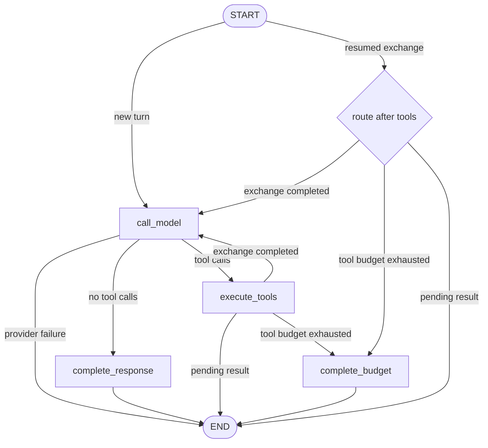
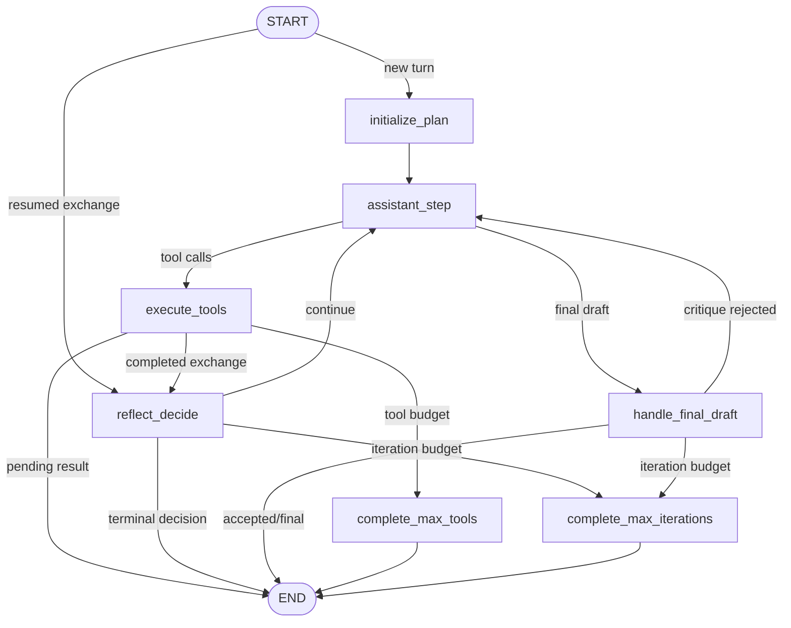

# LangGraph kernel migration

This document records the first seven steps of the incremental migration of the
conversation agent kernel. The public conversation API and every durable
storage contract remain unchanged.

## Implemented scope

1. The existing direct and investigation control flows are mapped below.
2. Direct execution has a typed internal `AgentGraphState`.
3. `CoreSettings.agent_kernel_backend` selects `native` or `langgraph`; native
   remains the default.
4. The direct model/tool loop is a real multi-node LangGraph graph. The native
   fallback executes the same node implementations with an ordinary loop.
5. Pending tools persist a versioned graph cursor and resume inside the selected
   kernel after agent-core restores the tool exchange.
6. `investigate` and `deep_investigate` use a second multi-node graph when the
   LangGraph backend is enabled.
7. Native and LangGraph kernels run against the same direct, investigation,
   deep-investigation, and pending/resume contract tests.

`AgentRunService` and `StructuredTaskRunner` remain outside this
conversation-kernel migration.

## Existing orchestration map

The public entry point binds a `RunContext`, creates budget, context-planning,
and artifact scopes, acquires the session scope, builds the prompt, and starts
the run trace. It then routes by `RunOptions.mode`:

- `direct` enters the model/tool loop described below;
- `investigate` and `deep_investigate` enter `InvestigationController`, which
  selects its native loop or LangGraph kernel;
- all paths finalize the existing `RunTrace` and return `AgentTurnResult`.

Pending tools stop the current invocation after agent-core has persisted the
exact provider transcript, counters, artifact usage, budget usage, trace id,
and remaining tool cursor. `resume_turn()` restores those values, finishes any
remaining calls in the same tool exchange, validates the durable graph cursor,
clears the pending marker, then resumes the selected graph after its tool node.

## Direct graph



The graph nodes are intentionally coarse enough that a node completes one
agent-core atomic effect boundary:

- `call_model` accounts the request, invokes the configured provider, appends
  the assistant message, and records response telemetry;
- `execute_tools` delegates authorization, execution, artifact publication,
  tool history, atomic exchange persistence, and pending persistence to the
  existing implementation;
- `complete_response` persists the conversation turn and commits memory;
- `complete_budget` writes the deterministic budget terminal response and
  commits memory.

Provider failures are handled in `call_model` by the existing deterministic
failure path and route directly to `END`.

## Investigation graph



Planning, reflection, decision, critique, and final synthesis remain implemented
by the existing controller operations. LangGraph now owns their ordering and
terminal routes. This keeps the structured-output contracts, recovery policy,
trace events, and conversation-memory behavior shared with the native kernel.

## Typed ephemeral state

`agent_core.agent_graph.state.AgentGraphState` and `InvestigationGraphState`
contain only the values needed to route one in-process invocation:

- identity and input: `user_input`, `session_id`, `context`, `turn_index`;
- provider transcript: `messages`, `assistant_message`;
- loop counters: `model_call_index`, `tool_calls_used`, `exchange_index`;
- context-reserve accounting and its one-shot warning flag;
- current `ToolExecutionStepResult`, terminal `AgentTurnResult`, and `RunTrace`.

The investigation state additionally carries `RunOptions`, the bounded
`InvestigationState`, progress counters, and the current final draft.

This type is internal and is not a serialized schema. LangGraph message types
are not introduced: the graph keeps using agent-core's `LLMMessage` and
`AgentTurnResult` contracts.

## State ownership

| Concern | Owner in this phase | Reason |
| --- | --- | --- |
| In-process conversation transitions | LangGraph when enabled | Makes direct and investigation routes explicit |
| Provider and model translation | Existing `BaseLLMProvider` adapters | Preserves the Chantier 1 boundary |
| Tool authorization and execution | Agent-core | Preserves policy and SPI contracts |
| Tool artifacts and transcript projection | Agent-core | Preserves lossless artifact semantics |
| Session and conversation memory | `SessionManager` and memory journal | Avoids storage/schema migration |
| Pending tool resume | Agent-core pending payload plus versioned graph cursor | Preserves restart and idempotence behavior |
| LLM budget and context planning | Existing scoped controllers | One controller still spans model and memory calls |
| Run traces | Existing `RunTrace` repository | Preserves current audit format |
| LangGraph checkpointing | Disabled | Prevents dual writes and ambiguous recovery authority |
| LangSmith export | Explicit agent-core opt-in | Graph state can contain the complete transcript |

The graphs are therefore compiled without a LangGraph `BaseCheckpointSaver`.
A pending payload embeds a small `agent_graph_checkpoint` containing its schema
version, graph name, backend, and resume node. On resume, agent-core validates
that cursor, restores the authoritative transcript and counters, records an
`agent_graph_checkpoint_restored` trace event, then creates a fresh in-process
graph invocation at the post-tool route. This is deliberate: there is still one
durable source of truth, not two competing checkpoints.
Graph execution is wrapped in a disabled LangSmith tracing context unless
`CoreSettings.langchain_tracing_enabled` is explicitly set, even when tracing
is enabled in the surrounding process environment.

## Backend selection and rollback

The default remains:

```python
CoreSettings(agent_kernel_backend="native")
```

The migrated conversation paths are enabled with:

```python
CoreSettings(agent_kernel_backend="langgraph")
```

The quickstart equivalent is
`AGENT_CORE_AGENT_KERNEL_BACKEND=langgraph`. Unknown values fail when the
orchestrator is constructed. Switching back to native does not require a data
migration because both backends use the same persistence contracts and node
behavior.

## Compatibility evidence

The deterministic parity suite runs the native and LangGraph direct,
investigation, and deep-investigation kernels against the same scripted
providers. It compares results, metadata, investigation state, provider calls,
context blocks, memory journals, tool history, and trace events. Dedicated
cases cover initial planning, reflection/decision, critique rejection,
pending/resume, corrupt cursors, provider failure, and budget exhaustion. The
existing direct, pending, trace, memory, budget, context-planning, and
investigation suites remain the broader regression net.
The opt-in paid Azure suite additionally runs the native and LangGraph kernels
against the same real LangChain-backed model, checking the complete tool loop,
persisted trace telemetry, and pending/resume cycles. Its paired kernel evals
also cover competing-tool selection, structured investigation output, and
fully real planning/reflection/decision/finalization and deep-critique
paths. Each pair asserts the same call targets, selected tools, persistence
projection, and trace-event sequence, while reporting token and latency deltas
without treating noisy one-shot performance measurements as correctness gates.

## Remaining platform work

The following work remains outside these seven steps:

- decide whether LangGraph or agent-core becomes the single durable checkpoint
  authority, then design and test a one-way storage migration;
- model external pending tools with LangGraph interrupts only after tool-node
  side effects are made explicitly idempotent at the interrupt boundary;
- migrate headless structured runs only if a graph adds value without weakening
  their stricter before/after-tool checkpoint protocol;
- expose graph streaming or inspection through a deliberate public contract,
  rather than leaking internal LangGraph objects.
